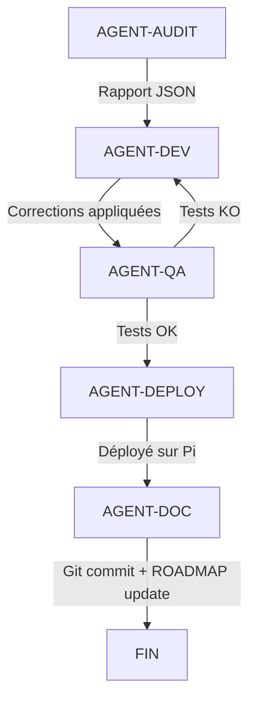

# 🤖 Plan d'Orchestration Agents IA - PiSignage v0.8.5
## Complétion ROADMAP.md avec Stratégie Multi-Agents

**Date de création** : 30 Septembre 2025
**Objectif** : Terminer Phases 3, 4 et 5 de la ROADMAP avec agents IA autonomes
**Méthode** : Analyse → Correction → Test → Déploiement → Documentation → Git Push

---

## 📊 État Actuel (Point de Départ)

### ✅ Phase 1 - Audit Initial : TERMINÉE
- 4/9 modules audités (Dashboard, Media, Playlists, Player)
- 16 tests Puppeteer créés
- 7 bugs identifiés

### ✅ Phase 2 - Corrections Prioritaires : TERMINÉE
- 7/7 bugs corrigés (BUG-001 à BUG-007)
- 2 bugs runtime corrigés (BUG-008, BUG-009)
- 100% succès tests Puppeteer (16/16)
- Déploiement production : ⚠️ Partiel (cache navigateur)

### 🔄 Phase 3 - Tests Approfondis : EN COURS (0%)
- Tests responsifs
- Tests de charge
- Tests de sécurité
- Tests cross-browser
- Tests d'intégration
- Tests de performance

### 🔄 Phase 4 - Modules Non Testés : EN ATTENTE (0%)
- Config (settings.php)
- Scheduler (schedule.php)
- Screenshots (screenshot.php)
- Logs (logs.php)
- YouTube (youtube.php)

### 🔄 Phase 5 - Optimisations : EN ATTENTE (0%)
- Performances
- Mémoire
- Bundle size
- UX/UI

---

## 🎯 Plan d'Action Multi-Agents

### 🏗️ Architecture de l'Équipe IA

```
ORCHESTRATEUR (Claude Code)
    │
    ├─── AGENT-AUDIT (Analyse & Tests)
    │    ├─ Puppeteer Test Runner
    │    ├─ Code Analyzer
    │    └─ Bug Reporter
    │
    ├─── AGENT-DEV (Corrections & Développement)
    │    ├─ Bug Fixer
    │    ├─ Feature Developer
    │    └─ Code Reviewer
    │
    ├─── AGENT-QA (Quality Assurance)
    │    ├─ Test Validator
    │    ├─ Integration Tester
    │    └─ Performance Analyzer
    │
    ├─── AGENT-DEPLOY (Déploiement)
    │    ├─ File Deployer
    │    ├─ Cache Manager
    │    └─ Service Restarter
    │
    └─── AGENT-DOC (Documentation)
         ├─ ROADMAP Updater
         ├─ Commit Writer
         └─ Changelog Generator
```

---

## 📋 PHASE 3 : Tests Approfondis

### Objectif
Valider la robustesse du système avec tests avancés

### Sprint 1 : Tests Responsifs (2h estimées)

#### 🤖 AGENT-AUDIT-RESPONSIVE
**Mission** :
1. Créer tests Puppeteer pour 3 viewports :
   - Mobile : 375x667 (iPhone)
   - Tablet : 768x1024 (iPad)
   - Desktop : 1920x1080 (Full HD)
2. Tester les 4 modules corrigés (Dashboard, Media, Playlists, Player)
3. Capturer screenshots pour chaque viewport
4. Identifier les problèmes CSS responsive

**Livrables** :
- `/opt/pisignage/tests/responsive-audit.js`
- `/opt/pisignage/tests/screenshots/responsive/`
- Rapport JSON des problèmes détectés

**Critères de succès** :
- Navigation fonctionnelle sur mobile
- Pas de débordement horizontal
- Boutons accessibles (taille minimum 44x44px)
- Texte lisible (minimum 16px)

#### 🤖 AGENT-DEV-RESPONSIVE
**Mission** :
1. Analyser le rapport AGENT-AUDIT-RESPONSIVE
2. Corriger les problèmes CSS identifiés
3. Utiliser media queries existantes dans `responsive.css`
4. Tester localement avant déploiement

**Fichiers cibles** :
- `/opt/pisignage/web/assets/css/responsive.css`
- `/opt/pisignage/web/assets/css/layout.css`
- `/opt/pisignage/web/assets/css/components.css`

**Contraintes** :
- Ne pas casser le design desktop
- Garder le style glassmorphisme
- Performance : pas de JS pour responsive

#### 🤖 AGENT-QA-RESPONSIVE
**Mission** :
1. Re-tester avec les corrections appliquées
2. Valider sur vraie tablette/mobile si possible
3. Vérifier touch events (tap, swipe)
4. Confirmer 100% succès responsive

**Tests** :
- Navigation tactile
- Zoom texte (accessibilité)
- Rotation portrait/paysage
- Soft keyboard impact

---

### Sprint 2 : Tests de Charge (1h estimée)

#### 🤖 AGENT-AUDIT-LOAD
**Mission** :
1. Tester upload fichier 500MB (limite configurée)
2. Tester upload multiple (10 fichiers simultanés)
3. Mesurer temps de traitement
4. Vérifier gestion mémoire sur Raspberry Pi

**Scénarios** :
```javascript
// Test 1 : Upload 500MB (limite max)
uploadFile('test-video-500mb.mp4')

// Test 2 : Upload multiple
uploadFiles(['video1.mp4', 'video2.mp4', ..., 'video10.mp4'])

// Test 3 : Upload avec erreurs réseau
uploadFileWithRetry('test-video.mp4', maxRetries: 3)
```

**Métriques attendues** :
- Upload 500MB : < 5 minutes
- Mémoire Pi : < 200MB utilisés
- CPU Pi : < 80% pendant upload
- Aucun crash du serveur

#### 🤖 AGENT-DEV-LOAD
**Mission** :
1. Optimiser upload si nécessaire (chunking)
2. Ajouter barre de progression précise
3. Implémenter retry automatique
4. Gérer erreurs réseau gracefully

**Améliorations possibles** :
- Chunked upload (10MB par chunk)
- WebSocket pour progression temps réel
- Compression côté client si possible
- Validation MD5/SHA256

---

### Sprint 3 : Tests de Sécurité (1h estimée)

#### 🤖 AGENT-AUDIT-SECURITY
**Mission** :
1. Tester validation inputs (XSS, SQL injection)
2. Vérifier authentification (auth.php)
3. Tester upload fichiers malicieux
4. Vérifier permissions fichiers
5. Scanner OWASP Top 10

**Scénarios de test** :
```
1. XSS : <script>alert('XSS')</script> dans nom fichier
2. Path Traversal : ../../../etc/passwd
3. File Upload : .php.jpg, .htaccess, virus.exe
4. Auth Bypass : cookies falsifiés, session hijacking
5. CSRF : actions sans token
```

**Outils** :
- Tests manuels avec Puppeteer
- Analyse statique du code PHP
- Vérification headers HTTP

#### 🤖 AGENT-DEV-SECURITY
**Mission** :
1. Corriger failles identifiées
2. Ajouter validations manquantes
3. Implémenter CSRF tokens si nécessaire
4. Durcir permissions fichiers

**Priorités** :
1. Validation upload (extension, MIME type, magic bytes)
2. Sanitization inputs (htmlspecialchars, filter_var)
3. Vérification auth sur toutes les pages
4. Headers sécurité (X-Frame-Options, CSP)

---

## 📋 PHASE 4 : Modules Non Testés

### Sprint 4 : Module Settings (2h estimées)

#### 🤖 AGENT-AUDIT-SETTINGS
**Mission** :
1. Créer tests Puppeteer pour settings.php :
   - Paramètres réseau (IP, DNS)
   - Paramètres display (résolution, rotation)
   - Paramètres audio (volume, sortie)
   - Actions système (reboot, shutdown)
2. Vérifier sauvegarde config.json
3. Tester persistance après reboot

**Tests clés** :
```javascript
// Test 1 : Change network settings
await page.type('#ip-address', '192.168.1.200')
await page.click('#save-network')
await verifyConfig('network.ip', '192.168.1.200')

// Test 2 : Display rotation
await page.select('#rotation', '90')
await verifyXrandr('--rotate left')

// Test 3 : Volume
await page.click('#volume-slider', {clickCount: 5})
await verifyVolume(50)
```

#### 🤖 AGENT-DEV-SETTINGS
**Mission** :
1. Corriger bugs identifiés
2. Implémenter validations (IP format, range)
3. Ajouter confirmation pour actions critiques
4. Tester sur vraie config Raspberry Pi

---

### Sprint 5 : Module Scheduler (2h estimées)

#### 🤖 AGENT-AUDIT-SCHEDULER
**Mission** :
1. Créer tests pour schedule.php :
   - Création planning (jour/heure début/fin)
   - Association playlist → schedule
   - Activation/désactivation schedule
   - Répétition (quotidienne, hebdo, mensuelle)
2. Vérifier cron jobs générés
3. Tester transitions playlist selon schedule

**Tests clés** :
```javascript
// Test 1 : Create daily schedule
await createSchedule({
    name: 'Matin 8h-12h',
    playlist: 'Morning News',
    days: ['mon', 'tue', 'wed', 'thu', 'fri'],
    start: '08:00',
    end: '12:00',
    repeat: 'daily'
})

// Test 2 : Schedule overlap detection
await createSchedule({...}) // Should warn if overlap

// Test 3 : Schedule execution
await waitForTime('08:00')
await verifyPlaylistActive('Morning News')
```

#### 🤖 AGENT-DEV-SCHEDULER
**Mission** :
1. Implémenter logique cron
2. Gérer conflits de plannings
3. Ajouter logs d'exécution
4. Interface drag & drop timeline (bonus)

---

### Sprint 6 : Module Screenshots (1h estimée)

#### 🤖 AGENT-AUDIT-SCREENSHOTS
**Mission** :
1. Tester capture manuelle
2. Tester capture automatique (intervalle)
3. Vérifier stockage `/opt/pisignage/screenshots/`
4. Tester suppression et rotation (max 100 screenshots)

**Tests clés** :
```javascript
// Test 1 : Manual screenshot
await page.click('#take-screenshot')
await verifyFileExists('/opt/pisignage/screenshots/screenshot-*.png')

// Test 2 : Auto capture every 5min
await enableAutoCapture(interval: 300)
await wait(600) // 10 minutes
await verifyScreenshotCount(2)

// Test 3 : Rotation
await fillScreenshots(150) // Exceed limit
await verifyScreenshotCount(100) // Oldest deleted
```

---

### Sprint 7 : Module Logs (1h estimée)

#### 🤖 AGENT-AUDIT-LOGS
**Mission** :
1. Tester affichage logs système
2. Tester filtres (error, warning, info)
3. Tester pagination (1000+ logs)
4. Tester export CSV/TXT
5. Vérifier rotation logs (max 10MB)

---

### Sprint 8 : Module YouTube (2h estimées)

#### 🤖 AGENT-AUDIT-YOUTUBE
**Mission** :
1. Tester download vidéo YouTube (yt-dlp)
2. Tester sélection qualité (720p, 1080p)
3. Tester barre de progression
4. Vérifier conversion format si nécessaire
5. Tester playlist YouTube (download multiple)

**Tests clés** :
```javascript
// Test 1 : Single video download
await page.type('#youtube-url', 'https://youtube.com/watch?v=...')
await page.select('#quality', '720p')
await page.click('#download-btn')
await waitForDownloadComplete()
await verifyMediaExists('video-title.mp4')

// Test 2 : Invalid URL
await page.type('#youtube-url', 'https://invalid-url.com')
await page.click('#download-btn')
await verifyErrorMessage('URL invalide')
```

#### 🤖 AGENT-DEV-YOUTUBE
**Mission** :
1. Vérifier yt-dlp installé sur Pi
2. Implémenter queue de téléchargements
3. Gérer erreurs (geo-blocking, copyright)
4. Optimiser pour Raspberry Pi (pas de 4K)

---

## 📋 PHASE 5 : Optimisations

### Sprint 9 : Optimisation Performances (2h estimées)

#### 🤖 AGENT-AUDIT-PERF
**Mission** :
1. Profiler chargement pages (Lighthouse)
2. Analyser bundle JavaScript (taille, parsing)
3. Mesurer temps API responses
4. Monitorer mémoire Raspberry Pi
5. Tester sur Pi Zero (contraintes max)

**Métriques cibles** :
```
First Contentful Paint (FCP) : < 1.5s
Time to Interactive (TTI)     : < 3.0s
Total Blocking Time (TBT)     : < 300ms
Cumulative Layout Shift (CLS) : < 0.1
API Response Time             : < 500ms
Memory Usage (Pi)             : < 100MB
```

#### 🤖 AGENT-DEV-PERF
**Mission** :
1. Minifier JS/CSS (terser, cssnano)
2. Lazy load modules non critiques
3. Optimiser images (WebP, compression)
4. Ajouter Service Worker (PWA)
5. Implémenter cache stratégique

**Optimisations prioritaires** :
```javascript
// 1. Code splitting
import('./media.js').then(module => module.init())

// 2. Image lazy loading


// 3. Cache API responses
localStorage.setItem('media-cache', JSON.stringify(data))

// 4. Debounce expensive operations
const debouncedSearch = debounce(searchMedia, 300)
```

---

## 🚀 Workflow d'Exécution Automatisé

### Protocole Standard pour Chaque Sprint



#### Étape 1 : Audit (AGENT-AUDIT-*)
```bash
1. Lancer tests Puppeteer spécifiques
2. Capturer screenshots
3. Générer rapport JSON :
   {
     "module": "settings",
     "tests_run": 12,
     "passed": 8,
     "failed": 4,
     "bugs": [
       {"id": "BUG-010", "severity": "medium", "description": "..."},
       ...
     ],
     "recommendations": ["..."]
   }
4. Retourner rapport à orchestrateur
```

#### Étape 2 : Développement (AGENT-DEV-*)
```bash
1. Analyser rapport AGENT-AUDIT
2. Prioriser corrections (critical > high > medium > low)
3. Pour chaque bug :
   a. Lire fichier concerné
   b. Appliquer correction avec Edit tool
   c. Tester localement
4. Commit local (pas de push encore)
5. Retourner liste fichiers modifiés
```

#### Étape 3 : Quality Assurance (AGENT-QA)
```bash
1. Re-lancer tests Puppeteer
2. Vérifier 100% succès sur module
3. Tester régression sur autres modules
4. Si échec : retour AGENT-DEV avec détails
5. Si succès : valider pour déploiement
```

#### Étape 4 : Déploiement (AGENT-DEPLOY)
```bash
1. Copier fichiers modifiés vers Raspberry Pi :
   sshpass -p "raspberry" scp fichiers.* pi@192.168.1.103:/tmp/
2. Appliquer sur Pi :
   sudo cp /tmp/fichiers.* /opt/pisignage/...
3. Vider cache :
   - Incrémenter versions JS/CSS (?v=856 → ?v=857)
   - Ou : sudo systemctl restart nginx
4. Attendre 30s stabilisation
5. Re-tester sur Pi (smoke test)
```

#### Étape 5 : Documentation (AGENT-DOC)
```bash
1. Mettre à jour ROADMAP.md :
   - Marquer sprint comme TERMINÉ
   - Ajouter métriques (bugs corrigés, tests passés)
   - Mettre à jour % progression
2. Générer message de commit descriptif
3. Git add + commit + push :
   git add .
   git commit -m "🎯 [Sprint X] Module Y - Z bugs corrigés"
   git push origin main
4. Mettre à jour mémoire MCP
```

---

## 📊 Tracking & Métriques

### Dashboard de Progression (à créer)

```javascript
// /opt/pisignage/tests/progress-dashboard.json
{
  "roadmap_version": "2.0",
  "last_update": "2025-09-30T14:00:00Z",
  "phases": {
    "phase1_audit": { "status": "completed", "progress": 100 },
    "phase2_fixes": { "status": "completed", "progress": 100 },
    "phase3_advanced_tests": {
      "status": "in_progress",
      "progress": 0,
      "sprints": {
        "responsive": { "status": "pending", "progress": 0 },
        "load": { "status": "pending", "progress": 0 },
        "security": { "status": "pending", "progress": 0 }
      }
    },
    "phase4_untested_modules": {
      "status": "pending",
      "progress": 0,
      "modules": {
        "settings": { "status": "pending", "tests": 0, "bugs": 0 },
        "scheduler": { "status": "pending", "tests": 0, "bugs": 0 },
        "screenshots": { "status": "pending", "tests": 0, "bugs": 0 },
        "logs": { "status": "pending", "tests": 0, "bugs": 0 },
        "youtube": { "status": "pending", "tests": 0, "bugs": 0 }
      }
    },
    "phase5_optimizations": { "status": "pending", "progress": 0 }
  },
  "metrics": {
    "total_tests": 16,
    "tests_passed": 16,
    "bugs_identified": 9,
    "bugs_fixed": 9,
    "modules_completed": 4,
    "modules_remaining": 5,
    "lines_of_code_modified": 342,
    "commits": 12
  }
}
```

---

## 🎯 Planning Estimé

| Phase | Sprint | Durée | Agent Principal | Priorité |
|-------|--------|-------|----------------|----------|
| **Phase 3** | Responsive | 2h | AGENT-AUDIT-RESPONSIVE | 🔥 Haute |
| **Phase 3** | Load Testing | 1h | AGENT-AUDIT-LOAD | 🔥 Haute |
| **Phase 3** | Security | 1h | AGENT-AUDIT-SECURITY | 🔥 Haute |
| **Phase 4** | Settings | 2h | AGENT-AUDIT-SETTINGS | 🟡 Moyenne |
| **Phase 4** | Scheduler | 2h | AGENT-AUDIT-SCHEDULER | 🟡 Moyenne |
| **Phase 4** | Screenshots | 1h | AGENT-AUDIT-SCREENSHOTS | 🟡 Moyenne |
| **Phase 4** | Logs | 1h | AGENT-AUDIT-LOGS | 🟡 Moyenne |
| **Phase 4** | YouTube | 2h | AGENT-AUDIT-YOUTUBE | 🟡 Moyenne |
| **Phase 5** | Performance | 2h | AGENT-AUDIT-PERF | 🟢 Basse |

**Durée totale estimée** : **14 heures** de travail agents IA

**Répartition** :
- Phase 3 : 4h (28%)
- Phase 4 : 8h (57%)
- Phase 5 : 2h (14%)

---

## ✅ Critères de Succès Global

### Phase 3 (Tests Approfondis)
- [ ] ✅ Responsive : 3 viewports testés, 0 problèmes critiques
- [ ] ✅ Load : Upload 500MB OK, mémoire < 200MB
- [ ] ✅ Security : 0 failles critiques, validations en place

### Phase 4 (Modules Non Testés)
- [ ] ✅ Settings : 100% tests OK, config persistante
- [ ] ✅ Scheduler : Plannings fonctionnels, cron OK
- [ ] ✅ Screenshots : Capture + rotation OK
- [ ] ✅ Logs : Filtres + export OK
- [ ] ✅ YouTube : Download + conversion OK

### Phase 5 (Optimisations)
- [ ] ✅ Lighthouse score > 90/100
- [ ] ✅ Bundle JS < 200KB (gzipped)
- [ ] ✅ FCP < 1.5s, TTI < 3s
- [ ] ✅ Mémoire Pi < 100MB par page

### Déploiement Final
- [ ] ✅ Tous modules déployés sur Pi production
- [ ] ✅ Cache navigateur invalidé (versions JS/CSS++)
- [ ] ✅ Tests Puppeteer 100% succès (tous modules)
- [ ] ✅ GitHub synchronisé (all commits pushed)
- [ ] ✅ ROADMAP.md v3.0 publié

---

## 🚦 Commandes de Contrôle

### Lancer un Sprint Spécifique
```bash
# Exemple : Sprint Responsive
node /opt/pisignage/tests/orchestrator.js --sprint responsive

# Ou via Claude Code
"Lance le sprint responsive avec AGENT-AUDIT-RESPONSIVE"
```

### Suivre la Progression
```bash
# Afficher dashboard
cat /opt/pisignage/tests/progress-dashboard.json | jq

# Voir logs agents
tail -f /opt/pisignage/logs/ai-agents.log
```

### Rollback si Problème
```bash
# Restaurer backup
git reset --hard HEAD~1
sudo systemctl restart nginx
```

---

## 📝 Notes Importantes

### Précautions
1. **Toujours tester localement** avant déploiement Pi
2. **Backup automatique** avant chaque déploiement
3. **Tests de régression** après chaque correction
4. **Cache invalidation** systématique (versions JS/CSS)
5. **Git commit atomiques** (1 sprint = 1 commit)

### Gestion des Erreurs
Si un agent échoue :
1. Logger l'erreur dans `ai-agents.log`
2. Notifier orchestrateur
3. Rollback modifications si critique
4. Retry avec stratégie différente ou escalade humain

### Communication Inter-Agents
```javascript
// Format message standard
{
  "from": "AGENT-AUDIT-RESPONSIVE",
  "to": "AGENT-DEV-RESPONSIVE",
  "timestamp": "2025-09-30T14:30:00Z",
  "type": "report",
  "payload": {
    "bugs": [...],
    "recommendations": [...]
  }
}
```

---

**Prêt à démarrer l'exécution ?** 🚀

**Commande suivante suggérée** :
```
"Lance le Sprint 1 (Responsive) avec l'équipe d'agents IA"
```

Cette commande déclenchera :
1. AGENT-AUDIT-RESPONSIVE : Création tests + audit
2. AGENT-DEV-RESPONSIVE : Corrections CSS
3. AGENT-QA-RESPONSIVE : Validation
4. AGENT-DEPLOY : Déploiement Pi
5. AGENT-DOC : Commit + ROADMAP update

**Temps estimé** : 2 heures
**Résultat attendu** : Module responsive 100% fonctionnel sur mobile/tablet/desktop
